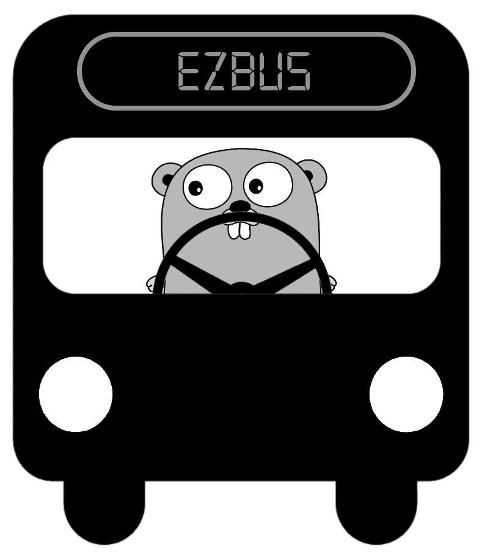

# go-ezbus [](https://circleci.com/gh/zapote/go-ezbus/tree/master) 



This is a package for communication between software components. It helps with send, publish and receive messages.

Using RabbitMQ as transport for messages. More transports can and will (hopefully) be added

#### install
`go get github.com/zapote/go-ezbus`

## idea
Ezbus is great to use when working in a distrubuted system. Publish events when a software executes a command and let rest of the system now. 

Plugin new software components without touching the existing one.

Ezbus is super easy to use and will get you started in no time.

## code example
```go
//PlaceOrder command
type PlaceOrder struct {
	ID string
}

//OrderPlaced event
type OrderPlaced struct {
	ID string
}

//create message router
r := ezbus.NewRouter()

//register handler for message PlaceOrder
r.Handle("PlaceOrder", func(message) {
    PlaceOrder po
    json.Unmarshal(m.Body, &po) 
    bus.Publish(OrderPlaced {po.ID})
})

//create a rabbitmq broker
b := rabbitmq.NewBroker("my-queue");

//create the bus with router and broker
bus := ezbus.NewBus(b, r)

//Go!
bus.Go()
```